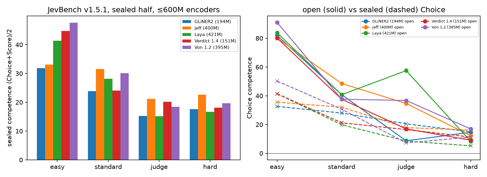

# Von 1.3

Von is an open-source, non-autoregressive **System One** decision model: it picks an
option, judges a condition or rates a level in one bidirectional forward pass, with no
token generation. This card is about the weights. Install, CLI, wire protocol and
examples are in the repo: https://github.com/wfzyx/von

- **Version:** 1.3 (`von-1.3.0`; engine release, weights unchanged from 1.2)
- **Size:** 395M (ModernBERT-large backbone + Option-Marker scoring head), 1.5 GB fp32
- **Context:** 8192 tokens
- **License:** Apache-2.0
- **Weights SHA:** `5df8185a4f2327ad0a7cd117cc4f701ac557b9ae`

```bash
pip install "von-sdk>=1.3.6"
```

> Previously published as `wfzyx/von-1.0`; the old id redirects.

## Files

| File | Purpose |
|---|---|
| `model.safetensors` | ModernBERT-large backbone (fine-tuned) |
| `option_marker.pt` | Option-Marker scoring head |
| `marker_calibration.json` | Calibration map, zero-shot Noul prior, and `independent_options: true` — the SDK reads this flag to run the order-invariant attention mode these weights were trained under. Do not drop it. |
| `config.json`, `tokenizer*` | Standard HF config and tokenizer |

## Architecture

The state, the question and every candidate option are packed into **one** sequence.
Each option gets a `[MASK]` marker whose final hidden state is scored by a small head;
a softmax over the marker logits is the answer distribution. Cost is one encoder pass
regardless of option count. Noul is a two-option Choice over "condition holds / is false"
descriptions (or the caller's `criteria`); Score is a Choice over level descriptions with
the expectation taken over the distribution.

**Order-invariant scoring (since 1.2).** Inside the encoder an option's tokens attend only
to the shared premise and to that option's own tokens, and every option's position ids
restart at the end of the premise; ModernBERT's sliding-window attention is computed from
those ids. Each option's logit is therefore a function of *(premise, that option)* alone:
permuting the options permutes the logits and changes nothing else. Measured on JevBench
hard, 111 items × 4 orderings: 1.1 flipped 49.5 % of answers, 1.2 flips **0**.

## Training data

Base: ModernBERT-large (2T tokens general web, technical text and code). Fine-tuning is
a listwise softmax cross-entropy + Brier objective over the option markers, with
independent-options masking and digit-split tokenisation, on a ~290k-item balanced
decision corpus, then continue-trained on synthetic two-hop and numeric sets. Every row
is the same shape the model serves: `state`, `question`, described options, gold (or a
soft target distribution where the source gives one).

| Cluster | Share | Sources and tasks |
|---|---|---|
| Operational & enterprise workflow | ~25 % | IT ticket triage, customer intent routing (Banking77), billing/refund policy, warranty checks, order exceptions |
| Security, DevOps & compliance | ~20 % | Secret-leak and SQL-injection screening, phishing, commit intent, on-call routing, PII |
| Safety, policy & moderation | ~15 % | Ad policy, Fair Housing, travel-expense limits, ToS gating |
| Linguistic & content semantics | ~15 % | Formality, grammar error taxonomy, emotion/sentiment (dair-ai/emotion), reading level |
| Triage & services | ~10 % | Symptom and veterinary urgency, 311 routing, dietary/allergen checks |
| Adversarial reasoning anchor | ~15 % | ANLI R1–3 + WANLI as Noul entailment and 3-way Choice, kept to anchor general logic |

No JevBench item, public or sealed, is used for gradient training. The calibration map
was fitted on the 231 public JevBench items (see Calibration); jabr v2, Decision Index
and the coding-agent probes below are fully out of sample.

Corpus builders are in the repo under `training/` (`prepare_universal_dataset.py`,
`prepare_decision_dataset.py`, `generate_synthetic_decisions.py`,
`prepare_judge_diversity.py` for the judge-shaped and label-diverse public mix used in
1.4 experiments).

## Calibration

Confidence comes from an input-conditioned temperature stored in `marker_calibration.json`:
`T = bias + w_H·H_norm + w_len·log10(state_tokens)/4 + w_K·(K/8)`, clamped to [0.3, 12],
where `H_norm` is the normalised entropy of the raw option distribution. Temperature is
monotonic, so it never changes an answer, only how sure the answer claims to be. Noul
additionally passes through the `band` decision rule (`p' = 0.8 + 0.1·(p−0.5)`, mirrored
below 0.5) so every yes/no commits outside the 0.2–0.8 abstention band; `--noul-decision raw`
returns the calibrated posterior.

The shipped map is in-sample on JevBench public (Calibration axis 77.4 in-sample, 67.6
split-half) and **does not carry to other distributions** — out of domain Von can be
confidently wrong. `von calibrate labels.jsonl` refits it on your labels with frozen
weights on CPU in minutes; on a 38-label coding-agent probe set a scalar T = 2.15 took
ECE from 0.21 to 0.11.

## Benchmarks

### JevBench v1.5.1 (live board, sealed + open halves)



Chance-corrected competence (100 = perfect, 0 = chance) for Von 1.2 weights, per type
and tier. Sealed items are never seen by any submitter.

| type | half | easy | standard | judge | hard |
|---|---|---:|---:|---:|---:|
| Choice | open | 91.0 | 37.6 | 36.7 | 17.0 |
| Choice | sealed | 50.2 | 30.7 | 7.2 | 11.3 |
| Score | open | 6.3 | 56.5 | 39.9 | 36.5 |
| Score | sealed | 45.0 | 29.6 | 29.6 | 28.0 |
| Noul (1.2, raw posterior) | sealed | −92 | −100 | −96 | −100 |

Calibration 83.5, Cost 82.7, median latency 0.92 s (board measurement). The Noul row is
the v1.5 abstention rule meeting 1.2's hedged posteriors: nearly every Noul answer fell in
the 0.2–0.8 band and was scored as an abstention, which zeroes the Intelligence axis for
this row and for most calibrated encoders on the board. The `band` rule in 1.3.3+ fixes
the decision without touching the weights (public Noul competence −76.5 → +18.9 on
JevBench, −42 → +32 on jabr v2); the board row awaits re-measurement (JevBench #143).

Sealed Choice ties the 151M Verdict 1.4 (17.9) and trails the 194M GLiNER2 (21.0); Von
leads the encoder class on sealed Score (30.5) and open Choice (34.4). Von's open→sealed
Choice gap (14.7 pp against a field median of 5.2) is the clearest thing on this board and
is what 1.4 is aimed at.

### JevBench v1.4 (last board with a Von Intelligence score)

| system | params | I | C | S | K | composite | easy | standard | hard | sealed | sealed ECE |
|---|---|---|---|---|---|---|---|---|---|---|---|
| Jev 1.13 (closed) | — | 53.1 | 76.3 | 83.3 | 52.0 | 63.3 | 1.000 | 0.990 | 0.741 | 0.367 | — |
| jeff (GLiFormer-large) | ~400M | 36.8 | 67.9 | 63.5 | 76.6 | 30.6 | 1.000 | 0.760 | 0.377 | 0.331 | — |
| Laya (ModernBERT-large) | 421M | 36.1 | 63.7 | 71.1 | 86.2 | 30.3 | 0.944 | 0.729 | 0.341 | 0.308 | 0.172 |
| **Von 1.2** | 395M | 34.5 | **75.7** | 70.5 | 77.8 | 27.5 | 0.931 | 0.688 | 0.373 | 0.279 | **0.107** |

Speed 70.5 is an unmeasured carry-over; remeasured under the JevBench protocol Von runs
0.096 s raw p50 on 4 vCPU (OpenVINO, Speed 89.0) and 0.023 s on an A10G (94.2), inside
the Jev-class latency line. With the 1.3 chain-of-options engine on the same weights,
public hard goes 0.378 → 0.441 locally (2 vs 9 discordant, McNemar p = 0.065) with zero
discordant pairs on easy, standard and jabr v2.

### Out of sample

| suite | what | Von |
|---|---|---|
| [Decision Index v0.2.1](https://github.com/apolinario/decision-index) | 38 benchmarks, ~150k requests, no truncation (323 context-window refusals recorded as unsupported), 0 errors | **13.74** (raw 34.11, coverage 99.96 %), p50 32.8 ms on A10G |
| [jabr v2](https://github.com/jabr/classifier-benchmark) | 49 tasks, 869 cases, out-of-domain routing/judgment | 72.0 % macro (Choice macro 83.0 %) |
| ViZDoom Defend-the-Center | 8-seed zero-shot control, six text-described actions per frame | 9.0 kills/episode at ~18 ms/decision (Jev 1.13: 5.6) |
| Coding-agent probes (Hagetino, issue #21) | turn tagging / failure triage / note relation / evidence, 38 labels | 26/38 Choice; same on 1.2 and 1.3 |

Every accuracy claim goes through a paired exact McNemar test with a minimum detectable
effect; results below the MDE are reported as UNRESOLVABLE.

## Limitations

- English only. Other languages get token overlap with unearned confidence.
- Selects and scores; does not write text.
- Weak on long multi-clause policy and multi-hop temporal/numeric composition (hard tier
  ~0.37–0.44); the chains engine covers the computable subset only.
- `judge` without `criteria` is the weakest path: generic "holds / is false" descriptions
  plus surface cues. Pass criteria or phrase as a described Choice.
- Known training gap: auth failures (401/403), rate limits and tool rejections route to a
  generic code-error option with high confidence (issue #22).
- Calibration map is JevBench-shaped; refit with `von calibrate` if you act on the
  confidence values.

## Citation

```bibtex
@software{von2026,
  title  = {Von: An Open-Source System One Decision Model},
  author = {Panisa, Victor Hugo},
  year   = {2026},
  url    = {https://github.com/wfzyx/von}
}
```
